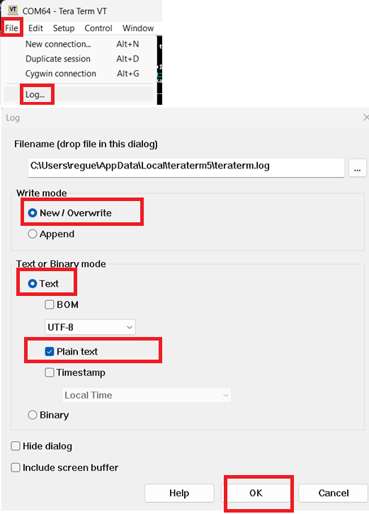
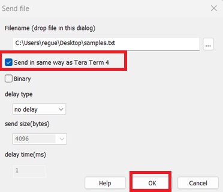
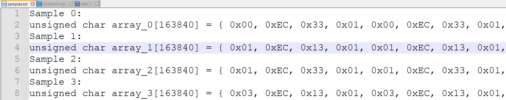

# pico-ps2-diagnostic-tool
Tool designed to capture and replay signals on a PS/2 interface, specifically targeting the DATA and CLOCK lines.


In the image above, the top section displays the original PS/2 signals from a keyboard, while the bottom section shows the replayed signals previously stored in flash memory on the Raspberry Pi Pico. A short pulse was captured on the original CLOCK signal, and the replayed signal successfully reproduced it.

A "capture" refers to a sequence of GPIO readings taken at short intervals, effectively logging the entire state timeline of the PS/2 pins during the recording session. These captures can be replayed to emulate the original signals, stored in flash memory, deleted, or exported for further analysis.

The tool supports multiple captures in flash memory, enabling operations such as recording, replaying, deleting, importing, and exporting. This makes it a versatile diagnostic solution for analyzing PS/2 device signals or debugging signal issues.

The captures can be exported from the Raspberry Pi Pico flash to COM port and new captures can be imported from the PC to the Raspberry Pi Pico internal flash through the COM port.

Additionally, the tool includes a glitch detector that monitors and flags extremely short pulses on the PS/2 clock line. (made by some PS2-USB adapters)

-----

I developed this project to assist my customers in providing more detailed reports about the behavior of problematic PS/2-to-USB adapters, including glitches and other anomalies, for my okhi project (Open Keylogger Hardware Implant – USB & PS/2 Keyboards) https://github.com/therealdreg/okhi


# Download last firmware
Download the latest firmware from the releases section:

https://github.com/therealdreg/pico-ps2-diagnostic-tool/releases/latest

# Flashing the firmware
To flash the firmware, you need to put the Raspberry Pi Pico in bootloader mode. To do this, press and hold the button while connecting the USB cable to the PC. The Pico will appear as a USB mass storage device. Drag and drop the "pico_ps2_diagnostic_tool.uf2" firmware file to the Pico.

# RequirementsS
To record PS/2 signals, you will need a Raspberry Pi Pico (or my okhi implant) with the following connections:
- DATA on GPIO20
- CLOCK on GPIO21

To replay these signals, use the following connections:
- DATA on GPIO0
- CLOCK on GPIO1

# Example of use

Connect to the COM port of the Raspberry Pi Pico and run the following commands. Use Windows Device Manager to identify the correct COM port. (Baud Rate 9600, 8 data bits, 1 stop bit, no parity, no flow control):

```
pico_ps2_diagnostic_tool started! v1 Build Date Jan 27 2025 12:07:25
https://github.com/therealdreg/pico-ps2-diagnostic-tool
MIT License David Reguera Garcia aka Dreg
X @therealdreg dreg@rootkit.es
---------------------------------------------------------------
overclocked 250mhz: false
Total captures stored in flash: 10
-
Options:
0: Glitch detector
1: Record, replay and store
2: Delete all captures stored in flash
3: Play all captures stored in flash
4: Export all captures stored in flash
5: Play one capture stored in flash
6: Import all captures to flash
7: Nuke PICO FLASH (erase full flash)
8: Enable/Disable Overclock 250mhz
```
Select option 1 to record, replay, and store captures.

Quickly press the Caps Lock key on the PS/2 keyboard multiple times to generate several captures.

The captures are now stored in the Raspberry Pi Pico flash memory.

To replay the captures, select option 3.

To export the captures to the COM port, first select File -> Log in Tera Term:



- New / Overwrite
- Text
- Plain Text

Click OK.

Then, select menu option 4. This option exports all captures stored in the Raspberry Pi Pico flash memory to the COM port (as C arrays). You can send these captures to me for further analysis.

To import captures from the PC to the Raspberry Pi Pico internal flash through the COM port, select option 6.

You can paste the C arrays from the exported captures into the terminal and send them to the Raspberry Pi Pico. However, it is better to use File -> Send File... in Tera Term.



- Send in the same way as Tera Term 4

The file must contain the C arrays of the captures.



You can use the file [stuff/samples.zip](stuff/samples.zip) as an example.

Now you can replay the imported captures using option 3. (GPIO0 and GPIO1 is the replayed PS/2 interface)

# Related

- https://github.com/therealdreg/okhi
- https://github.com/therealdreg/pico-ps2-sniffer
